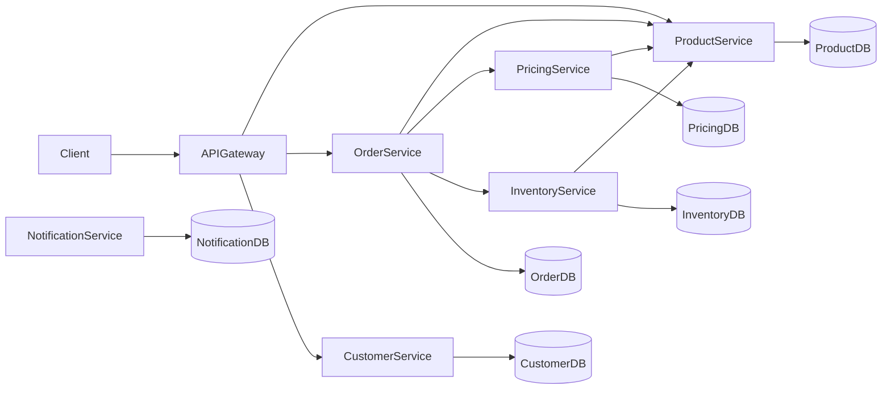
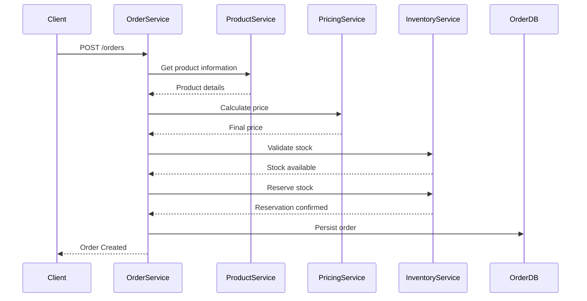
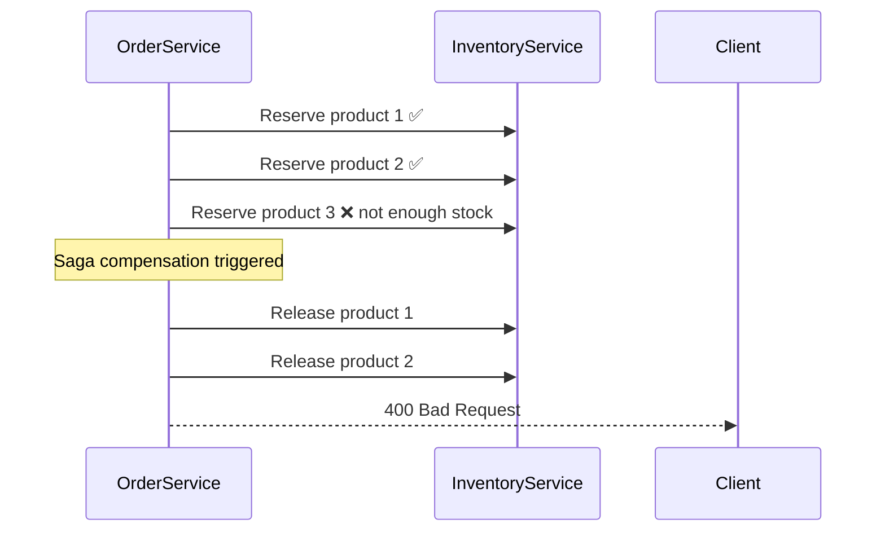

# 🛒 ECommerce Microservices (.NET)


Backend architecture for an **e-commerce platform built with .NET 8** using a **microservices-based design**.

This project demonstrates modern backend architecture practices including:

- Microservices architecture
- Domain modeling
- Service-to-service communication with resilience patterns
- Independent databases per service
- Clean domain entities
- Dockerized infrastructure with health checks
- REST APIs with ASP.NET Core
- Structured logging with Serilog
- Saga compensation pattern
- Scalable distributed system design

The system models a simplified e-commerce flow where customers can place orders, inventory is validated, pricing rules are applied, and services collaborate to complete the order lifecycle.

---

# 🚀 Tech Stack

### Backend
- .NET 8
- ASP.NET Core Web API
- Entity Framework Core
- C#

### Resilience
- Polly (via `Microsoft.Extensions.Http.Resilience`)
- Retry pattern
- Circuit Breaker pattern
- Saga compensation pattern

### Validation
- FluentValidation

### Logging
- Serilog
- Console sink
- File sink (rolling daily)

### API
- REST
- OpenAPI / Swagger

### Database
- SQL Server
- EF Core Migrations (applied automatically on startup)

### Infrastructure
- Docker
- Docker Compose
- Health Checks (per service, with EF Core check)

### Architecture
- Microservices
- Domain-driven modeling
- Interface-based HTTP clients
- Repository and service layers

---

# ✅ Implemented Features

### Product Service
- Create product
- Retrieve all products
- Retrieve product by id
- Update product
- Delete product (soft delete via IsActive)
- DTO mapping
- FluentValidation
- Structured logging

### Inventory Service
- Create inventory item (validates product exists in ProductService)
- Retrieve inventory by product
- Reserve stock
- Release stock
- Stock validation
- Structured logging

### Pricing Service
- Create pricing rules (validates product exists in ProductService)
- Retrieve pricing rules by product
- Rule evaluation engine
- Dynamic price calculation
- Support for pricing rule conditions:
  - Minimum quantity
  - Percentage discount
  - Fixed discount
  - Validity period (start / end date)
- Structured logging

### Order Service
- Create order with full inter-service orchestration
- Retrieve order by id
- Retrieve orders by customer
- Saga compensation pattern (auto-releases reserved stock on failure)
- Resilient HTTP clients with retry and circuit breaker (Polly)
- Structured logging

### Customer Service
- Create customer (with email uniqueness validation)
- Retrieve all customers
- Retrieve customer by id
- Update customer
- Delete customer
- FluentValidation
- Repository and service layers
- Structured logging

### Notification Service
- Send notification (persisted in SQL Server)
- Retrieve all sent notifications
- FluentValidation
- Structured logging

### Infrastructure
- Health check endpoint (`/health`) on every service
- EF Core health check (`SELECT 1` against the database)
- Docker Compose orchestration with `service_healthy` conditions
- Automatic EF Core migrations on startup
- Credentials managed via `.env` file (never committed)
- Structured logging via Serilog on all services
- Validation error logging via middleware

---

# 🏗 System Architecture

The platform is composed of **multiple independent microservices**, each responsible for a specific business capability.

Each microservice has:
- Its own **database**
- Its own **REST API**
- Its own **health check endpoint**
- Independent **deployment**
- A clear **bounded context**

Services communicate through **resilient HTTP APIs** using Polly.

---

# 📊 Architecture Diagram



---

# ☁️ Microservices

| Service | Responsibility | Status |
|---|---|---|
| ProductService | Product catalog management | ✅ Implemented |
| OrderService | Order creation and lifecycle | ✅ Implemented |
| CustomerService | Customer management | ✅ Implemented |
| NotificationService | Notifications and messaging | ✅ Implemented |
| InventoryService | Product stock validation and reservation | ✅ Implemented |
| PricingService | Pricing rules and price calculation | ✅ Implemented |
| PaymentService | Payment processing | 💤 Planned |
| API Gateway | Single entry point for clients | 💤 Planned |

Each service is designed to evolve **independently**.

---

# 📦 Project Structure

```
services
 ├─ ProductService
 ├─ OrderService
 ├─ CustomerService
 ├─ NotificationService
 ├─ InventoryService
 ├─ PricingService
 └─ PaymentService (planned)
```

Typical structure inside each service:

```
Clients
Controllers
Data
DTOs
Middleware
Migrations
Models
Repositories
Services
Validators
```

---

# 🔌 Service Ports

| Service | HTTP | Database |
|---|---|---|
| ProductService | 5100 | ProductDb |
| OrderService | 5200 | OrderDb |
| CustomerService | 5300 | CustomerDb |
| NotificationService | 5400 | NotificationDb |
| InventoryService | 5600 | InventoryDb |
| PricingService | 5700 | PricingDb |
| API Gateway | 5000 | — |

All services use **SQL Server running in Docker (port 1433)**.

---

# 🔐 Security & Configuration

Credentials and sensitive configuration are **never committed to the repository**.

All environment variables are managed via a `.env` file:

```bash
cp .env.example .env
# Edit .env with your credentials
```

The `.env.example` file is versioned as a reference template with placeholder values. The `.env` file is listed in `.gitignore`.

---

# 🐳 Running the Project

## Prerequisites
- Docker Desktop
- .NET 8 SDK (for local development without Docker)

## 1. Configure environment variables

```bash
cp .env.example .env
# Edit .env with your credentials
```

## 2. Start all services

```bash
docker compose up --build
```

Docker Compose will:
1. Start SQL Server and wait until it is **healthy**
2. Start ProductService and wait until it is **healthy**
3. Start InventoryService and PricingService (depend on ProductService being healthy)
4. Start OrderService once all dependencies are healthy

Swagger will be available at:
```
http://localhost:<port>/swagger
```

## 3. Health checks

Every service exposes a health endpoint:
```
GET http://localhost:<port>/health
```

## Useful commands

```bash
# View logs of a specific service
docker compose logs productservice

# Follow logs in real time
docker compose logs -f

# Check status of all containers
docker compose ps

# Stop all services
docker compose down

# Stop and remove volumes (resets databases)
docker compose down -v
```

---

# 🔄 Order Creation Sequence



---

# ⚔️ Saga Compensation Pattern

When order creation fails mid-flow (e.g. insufficient stock for one item), the system automatically **releases all previously reserved stock**:



---

# 🛡 Resilience Patterns

Inter-service HTTP communication is protected with **Polly** via `Microsoft.Extensions.Http.Resilience`.

Each HTTP client is configured with:

- **Retry** — up to 3 automatic retries with a 2-second delay between attempts
- **Circuit Breaker** — opens after 50% failure rate over a 30-second window (minimum 5 requests)

```csharp
builder.Services.AddHttpClient<IInventoryClient, InventoryClient>(client =>
{
    client.BaseAddress = new Uri("http://inventoryservice:8080");
})
.AddStandardResilienceHandler(options =>
{
    options.Retry.MaxRetryAttempts = 3;
    options.Retry.Delay = TimeSpan.FromSeconds(2);
    options.CircuitBreaker.SamplingDuration = TimeSpan.FromSeconds(30);
    options.CircuitBreaker.FailureRatio = 0.5;
    options.CircuitBreaker.MinimumThroughput = 5;
});
```

---

# 📋 Structured Logging

All services use **Serilog** for structured logging with console and file sinks.

Log levels used:
- `INF` — successful operations (order created, stock reserved, product updated)
- `WRN` — business rule violations (product not found, not enough stock, validation errors)
- `ERR` — unexpected failures and Saga compensation events

Example output:
```
[10:23:01 INF] Creating order for customer 1 with 2 items
[10:23:01 INF] Reserved 2 units of product 1
[10:23:01 WRN] Not enough stock for product 2, quantity requested 5
[10:23:01 ERR] Order creation failed for customer 1, starting Saga compensation
[10:23:01 INF] [SAGA] Released 2 units of product 1
```

---

# 📡 Service Communication Contracts

### Product Service
```
GET    /api/products
GET    /api/products/{id}
POST   /api/products
PUT    /api/products/{id}
DELETE /api/products/{id}
```

### Pricing Service
```
POST /api/pricing
POST /api/pricing/calculate
```

### Inventory Service
```
GET  /api/inventory/{productId}
POST /api/inventory
POST /api/inventory/reserve
POST /api/inventory/release
```

### Order Service
```
POST /api/order
GET  /api/order/{id}
GET  /api/order/customer/{customerId}
```

### Customer Service
```
GET    /api/customer
GET    /api/customer/{id}
POST   /api/customer
PUT    /api/customer/{id}
DELETE /api/customer/{id}
```

### Notification Service
```
GET  /api/notification
POST /api/notification
```

---

# 📚 Domain Concepts

## Order Lifecycle

```
Created → Confirmed → PaymentProcessing → Paid → Cancelled / Expired
```

Orders maintain a **status history** to track transitions between states.

---

# 🧠 Concepts Demonstrated

- Microservices architecture
- Domain-driven modeling
- Interface-based HTTP clients
- Resilient service communication (Polly — retry + circuit breaker)
- Saga compensation pattern for distributed transactions
- Health checks per service with Docker Compose orchestration
- Independent databases per service
- Clean entity design
- Repository and service layers
- FluentValidation with middleware logging
- Structured logging with Serilog
- Containerized infrastructure
- Credentials management with `.env`
- Automatic EF Core migrations on startup

---

# 🚧 Future Improvements

- API Gateway (YARP / Ocelot)
- Event-driven architecture
- Message broker (RabbitMQ / Kafka)
- Full Saga orchestration with state machine
- Observability with OpenTelemetry
- Authentication with JWT / Identity
- Container orchestration with Kubernetes
- Centralized configuration

---

# 📈 Development Status

Implemented:
- Product catalog service ✅
- Inventory reservation system ✅
- Pricing rule engine ✅
- Order service with full inter-service orchestration ✅
- Customer service ✅
- Notification service ✅
- Resilient HTTP clients with Polly ✅
- Saga compensation pattern ✅
- Health checks and Docker Compose orchestration ✅
- Structured logging with Serilog ✅
- FluentValidation on all services ✅
- Secure credentials management ✅

Next milestones:
- API Gateway (YARP)
- Event-driven communication with RabbitMQ
- JWT Authentication
- Kubernetes deployment

---

# 👨‍💻 Author

**Juan Sebastián Cárdenas Gómez**

Backend Engineer specialized in:
- .NET
- Java
- Microservices
- Cloud architecture
- Distributed systems

🔗 GitHub: https://github.com/sebastiancgomez  
🔗 LinkedIn: https://linkedin.com/in/sebastiancgomez