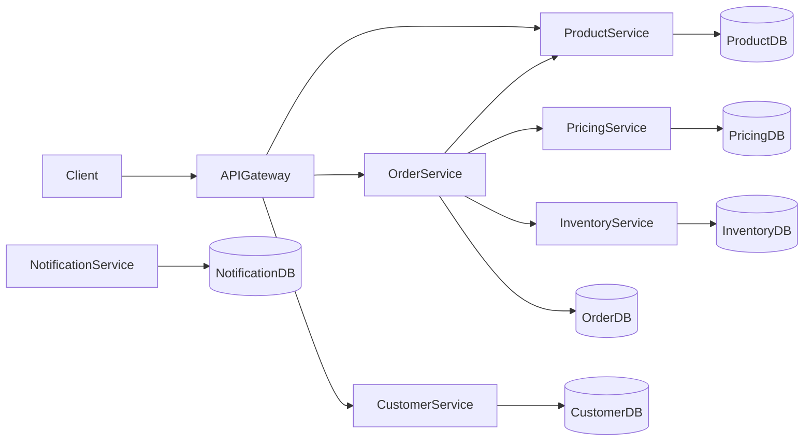
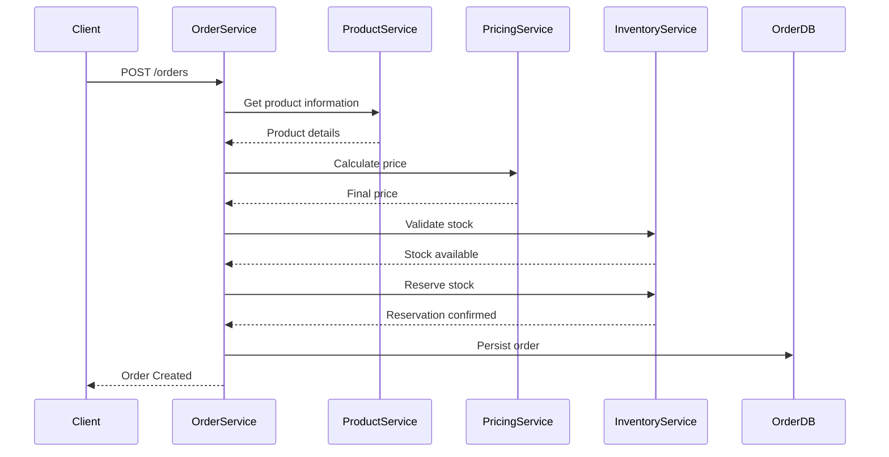

# 🛒 ECommerce Microservices (.NET)

Backend architecture for an **e-commerce platform built with .NET 8** using a **microservices-based design**.

This project demonstrates modern backend architecture practices including:

- Microservices architecture
- Domain modeling
- Service-to-service communication
- Independent databases per service
- Clean domain entities
- Dockerized infrastructure
- REST APIs with ASP.NET Core
- Scalable distributed system design

The system models a simplified e-commerce flow where customers can place orders, inventory is validated, pricing rules are applied, and services collaborate to complete the order lifecycle.

---

# 🚀 Tech Stack

### Backend

- .NET 8
- ASP.NET Core Web API
- Entity Framework Core
- C#

### API

- REST
- OpenAPI / Swagger

### Database

- SQL Server
- EF Core Migrations

### Infrastructure

- Docker
- Docker Compose (planned)

### Architecture

- Microservices
- Domain modeling
- Service clients (HTTP communication)

---

# 🏗 System Architecture

The platform is composed of **multiple independent microservices**, each responsible for a specific business capability.

Each microservice has:

- Its own **database**
- Its own **REST API**
- Independent **deployment**
- A clear **bounded context**

Services communicate through **HTTP APIs**.

---

# 📊 Architecture Diagram



---

# ☁️ Microservices

| Service | Responsibility |
|------|------|
ProductService | Product catalog management |
OrderService | Order creation and lifecycle |
CustomerService | Customer management |
NotificationService | Notifications and messaging |
InventoryService | Product stock validation and reservation |
PricingService | Pricing rules and price calculation |
PaymentService | Payment processing *(planned)* |
API Gateway | Single entry point for clients *(planned)* |

Each service is designed to evolve **independently**.

---

# 📦 Project Structure

```
services
 ├─ ProductService
 ├─ OrderService
 ├─ CustomerService
 ├─ NotificationService
 ├─ InventoryService
 ├─ PricingService
 └─ PaymentService (planned)

docker
 └─ sqlserver
```

Typical structure inside each service:

```
Controllers
Models
DTOs
Data
Clients
Migrations
```

---

# 🔌 Service Ports

| Service | HTTP | HTTPS | Database |
|------|------|------|------|
ProductService | 5100 | 7100 | ProductDb |
OrderService | 5200 | 7200 | OrderDb |
CustomerService | 5300 | 7300 | CustomerDb |
NotificationService | 5400 | 7400 | NotificationDb |
PaymentService | 5500 | 7500 | PaymentDb |
InventoryService | 5600 | 7600 | InventoryDb |
PricingService | 5700 | 7700 | PricingDb |
API Gateway | 5000 | 7000 | — |

All services use **SQL Server running in Docker (port 1433)**.

---

# 🐳 Running the Project

## 1. Start SQL Server with Docker

```
docker run -e "ACCEPT_EULA=Y" \
-e "SA_PASSWORD=YourPassword123!" \
-p 1433:1433 \
--name ecommerce-sql \
-d mcr.microsoft.com/mssql/server:2022-latest
```

---

## 2. Run database migrations

Inside each service:

```
dotnet ef database update
```

---

## 3. Run a service

Example:

```
cd services/ProductService
dotnet run
```

Swagger will be available at:

```
http://localhost:<port>/swagger
```

---

# 🔄 Order Creation Sequence

This sequence diagram illustrates how services collaborate during the order creation process.



---

# 📡 Service Communication Contracts

Inter-service communication is based on **REST APIs with DTO contracts**.

### Product Service

```
GET /products/{id}
```

Response example:

```json
{
  "id": 10,
  "name": "Laptop",
  "price": 1200.00
}
```

---

### Pricing Service

```
GET /pricing/product/{productId}
```

Response example:

```json
{
  "productId": 10,
  "basePrice": 1200.00,
  "finalPrice": 1150.00
}
```

---

### Inventory Service

```
POST /inventory/reserve
```

Request example:

```json
{
  "productId": 10,
  "quantity": 2
}
```

Response example:

```json
{
  "reservationId": "abc123",
  "status": "Reserved"
}
```

---

# 📚 Domain Concepts

## Order Lifecycle

Orders follow a status workflow:

```
Created
Confirmed
PaymentProcessing
Paid
Cancelled
Expired
```

Orders maintain a **status history** to track transitions between states.

Example domain entities:

```
Order
OrderItem
OrderStatus
OrderStatusHistory
```

The domain model ensures business rules such as:

- Quantity validation
- Item aggregation
- Order total calculation
- Status transition tracking

---

# 🧠 Concepts Demonstrated

Microservices architecture

Domain-driven modeling

Service communication via HTTP clients

Independent databases per service

Clean entity design

Containerized infrastructure

Scalable backend architecture

---

# 🚧 Future Improvements

Planned improvements include:

- API Gateway (YARP / Ocelot)
- Event-driven architecture
- Message broker (RabbitMQ / Kafka)
- Distributed transaction patterns (Saga)
- Observability with OpenTelemetry
- Authentication with JWT / Identity
- Container orchestration with Kubernetes
- Centralized configuration
- Resilience patterns (retry / circuit breaker)

---

# 👨‍💻 Author

**Juan Sebastián Cárdenas Gómez**

Backend Engineer specialized in:

- .NET
- Java
- Microservices
- Cloud architecture
- Distributed systems

This project was built as part of **backend architecture practice and cloud-native experimentation**.

🔗 GitHub: https://github.com/sebastiancgomez  
🔗 LinkedIn: https://linkedin.com/in/juan-sebastian-cardenas-gomez-aa624731
