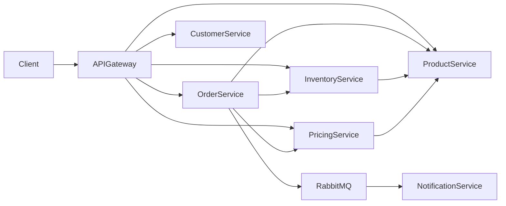
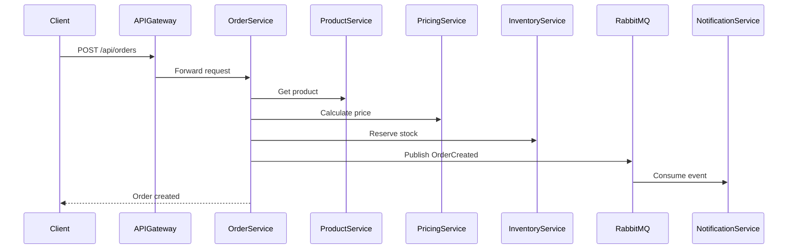

# 🛒 ECommerce Microservices (.NET)


Backend architecture for an **e-commerce platform built with .NET 8** using a **microservices-based design**.

This project demonstrates modern backend architecture practices including:

- Microservices architecture
- API Gateway with YARP
- Domain modeling
- Service-to-service communication with resilience patterns
- Independent databases per service
- Clean domain entities
- Dockerized infrastructure with health checks
- REST APIs with ASP.NET Core
- Structured logging with Serilog
- Saga compensation pattern
- Monitoring with Prometheus and Grafana
- Scalable distributed system design

---

# 🚀 Tech Stack

### Backend
- .NET 8
- ASP.NET Core Web API
- Entity Framework Core
- C#

### API Gateway
- YARP (Yet Another Reverse Proxy)

### Resilience
- Polly (`Microsoft.Extensions.Http.Resilience`)
- Retry pattern
- Circuit Breaker pattern
- Saga compensation pattern

### Validation
- FluentValidation

### Logging
- Serilog
- Console sink
- File sink (rolling daily)

### Monitoring
- Prometheus
- Grafana

### API
- REST
- OpenAPI / Swagger (per service)

### Database
- SQL Server
- EF Core Migrations (auto-applied on startup)

### Infrastructure
- Docker
- Docker Compose
- Health Checks

### Architecture
- Microservices
- API Gateway pattern
- Domain-driven modeling
- Repository & service layers

---

# ✅ Implemented Features

## Core Services
- ProductService
- InventoryService
- PricingService
- OrderService
- CustomerService
- NotificationService

## API Gateway
- Central entry point using YARP
- Routing to all microservices
- Path-based routing (`/api/products`, `/api/orders`, etc.)
- Containerized and integrated with Docker Compose

## Messaging
- RabbitMQ integration
- Event: `OrderCreated`
- Publisher: OrderService
- Consumer: NotificationService

## Monitoring
- Prometheus container for metrics collection
- Grafana container for visualization
- Ready for OpenTelemetry instrumentation

---

# 🏗 System Architecture



---

# 📦 Project Structure

```
ApiGateway/
services/
 ├─ ProductService
 ├─ OrderService
 ├─ CustomerService
 ├─ NotificationService
 ├─ InventoryService
 ├─ PricingService
monitoring/
 ├─ prometheus.yml
docker-compose.yml
```

---

# 🔌 Service Ports

| Service | Port |
|--------|------|
| API Gateway | 5000 |
| ProductService | 5100 |
| OrderService | 5200 |
| CustomerService | 5300 |
| NotificationService | 5400 |
| InventoryService | 5600 |
| PricingService | 5700 |
| Prometheus | 9090 |
| Grafana | 3000 |
| RabbitMQ | 5672 / 15672 |

---

# 🐳 Running the Project

## 1. Configure environment variables

```bash
cp .env.example .env
```

## 2. Start all services

```bash
docker compose up --build
```

---

# 🌐 Access Points

| Tool | URL |
|------|-----|
| API Gateway | http://localhost:5000 |
| Swagger (services) | http://localhost:<port>/swagger |
| Prometheus | http://localhost:9090 |
| Grafana | http://localhost:3000 |
| RabbitMQ UI | http://localhost:15672 |

---

# 🔍 Observability

## Prometheus
- Collects metrics from services
- Targets configured via `prometheus.yml`

## Grafana
- Visualizes system metrics
- Connects to Prometheus as data source

## Current State
- Infrastructure ready ✅
- Metrics instrumentation (OpenTelemetry) → pending

---

# 🔄 Order Flow



---

# ⚔️ Saga Pattern

- Ensures consistency across services
- Automatically compensates failed operations

---

# 🛡 Resilience

- Retry
- Circuit Breaker
- Timeout handling

Implemented using Polly.

---

# 📋 Logging

All services use structured logging with Serilog.

---

# 📡 API Gateway Routes

| Route | Service |
|------|--------|
| /api/products | ProductService |
| /api/orders | OrderService |
| /api/customers | CustomerService |
| /api/inventory | InventoryService |
| /api/pricing | PricingService |

---

# 🚧 Future Improvements

- OpenTelemetry metrics
- Distributed tracing (Jaeger)
- Authentication (JWT)
- Kubernetes deployment
- Centralized logging (ELK)
- Dashboard templates in Grafana

---

# 📈 Development Status

✔ Microservices architecture  
✔ API Gateway (YARP)  
✔ RabbitMQ messaging  
✔ Saga pattern  
✔ Dockerized environment  
✔ Health checks  
✔ Structured logging  
✔ Monitoring infrastructure  

---

# 👨‍💻 Author

**Juan Sebastián Cárdenas Gómez**

Backend Engineer specialized in:
- .NET
- Microservices
- Cloud architecture
- Distributed systems

🔗 GitHub: https://github.com/sebastiancgomez  
🔗 LinkedIn: https://linkedin.com/in/sebastiancgomez